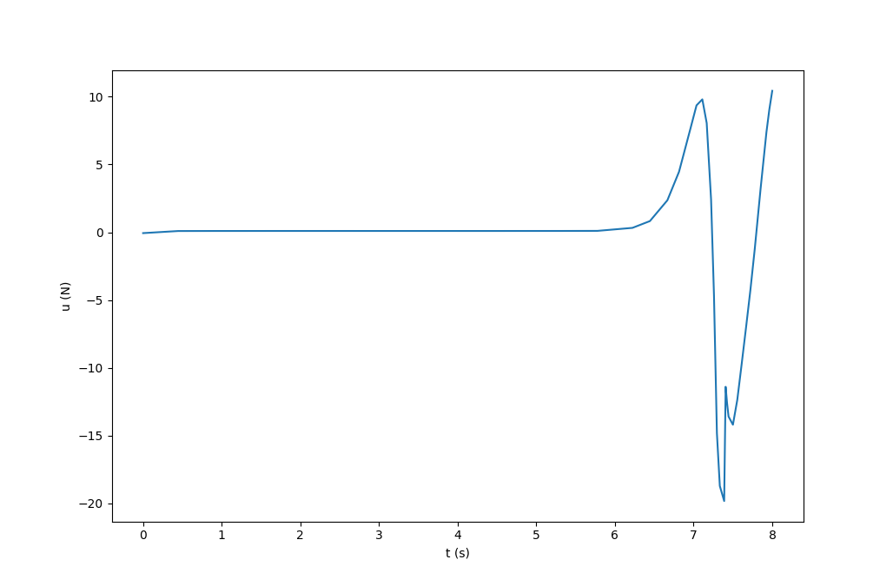

# Cartpole_Dircol
Simple repo demoing a cartpole swing up using PSOPT

Solution found using a poor guess. Shows how to link external code to PSOPT and start formulating your own direct optimal control problems. 

State History

    

Control History

    

